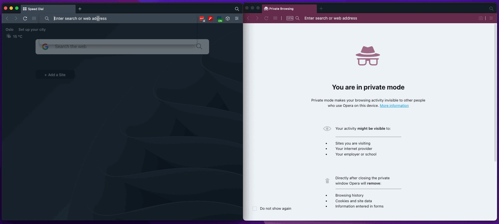

# `logs-streaming`

Demo implementation of a service that streams the output of a job using Web Sockets.

## Requirements

- Create a job from the client;
- Subscribe to a job's output logs;
- The job's output logs must be processed without blocking new requests to the service;
- At any given point any client must be able to subscribe to a job's output logs created by another client;

## How to run

- Install the dependencies of `client` and `server` app;
- Run `npm run start` on each app;
- Open the client from the following URL: [http://localhost:8080](http://localhost:8080)

## Glossary

- Job: any action performed on the server whose processing is detached an HTTP response; E.g.: Counting from 0 to 50;
- Client: any application that connects to the backend via web socket;
